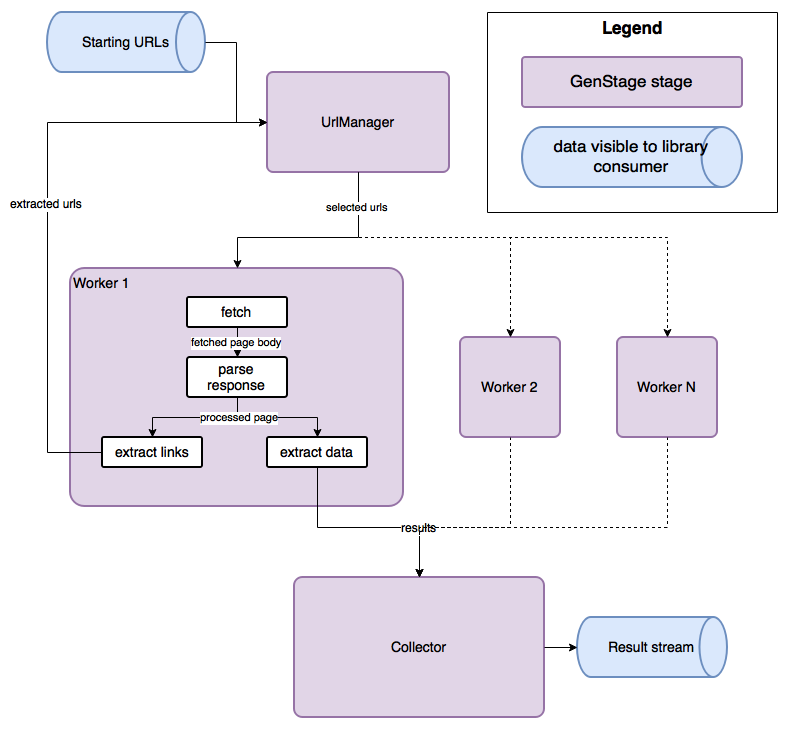

# Crawlie (the crawler) [](https://travis-ci.org/nietaki/crawlie) [](https://coveralls.io/github/nietaki/crawlie?branch=master) [](https://hex.pm/packages/crawlie) [](https://hexdocs.pm/crawlie/)

Crawlie is meant to be a simple Elixir library for writing decently-peforming crawlers with minimum effort. It's a work in progress, it doesn't do much yet.

## Usage example

See the [crawlie_example](https://github.com/nietaki/crawlie_example) project.

## Inner workings

*NOTE: this is the architecture planned for the 0.2 release, current implementation may differ*

Crawlie uses Elixir's [GenStage](https://github.com/elixir-lang/gen_stage) to parallelise
the work. In the system there are 3 kinds of stages:

- **UrlManager** - consumes the url collection passed by the user, receives the urls extracted by the workers, makes sure no url is processed more than once, makes sure that the "pending urls" collection
is as small as possible by traversing the url tree in a roughly depth-first manner.
- **Worker** - Fetches the url, extracts information from the response and passes
the extracted links back to the UrlManager and the retrieved information to the Collector.
- **Collector** - collects the information retrieved by workers and produces the output
stream.

Below is a rough diagram:



All per-page processing is done in a single stage to minimise the amount of data sent between
processes.

## Configuration

`TODO`

## Planned features

`TODO`

## Installation

The package can be installed as:

  1. Add `crawlie` to your list of dependencies in `mix.exs`:

    ```elixir
    def deps do
      [{:crawlie, "~> 0.1.1"}]
    end
    ```

  2. Ensure `crawlie` is started before your application:

    ```elixir
    def application do
      [applications: [:crawlie]]
    end
    ```
